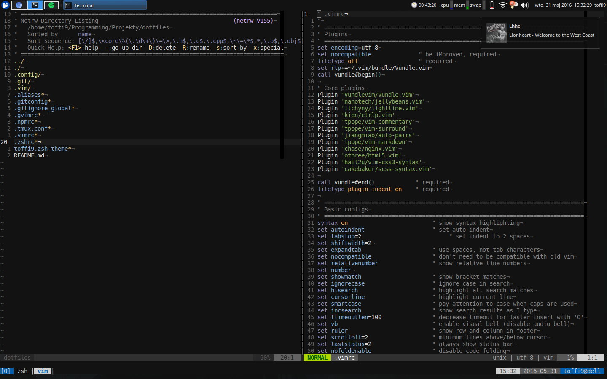

# .files

List of my tools of choice:

 * **Vim** with some cool plugins (i also use gvim) - text editor
 * **Tmux** - terminal multiplexer
 * **Zsh** with oh-my-zsh - my shell
 * **Xubuntu** Core (xfce4 + ubuntu) - as my dev environment
 * **Chromium** - web browser
 * **Spotify** Linux client - music
 * **Git** - version control
 * **Thunar** - file manager
 * **Gpicview** - image viewer
 * **Redshift** - app like f.lux, but for linux
 * **mpv** - video player
 * **Zathura** - pdf viewer
 * **Gimp** - images/graphics editor
 * **KeePassX** - password manager
 * **LibreOffice** - office suite
 * I also use sometimes virtualbox, wine, firefox, and some other useful tools etc.

## Screenshots

Main colors are #121212, and standard blue from Xubuntu theme.

----------

If you have any questions, make an issue in this repo :)

> Oh and this guy on wallpaper it's Benny Greb :D
